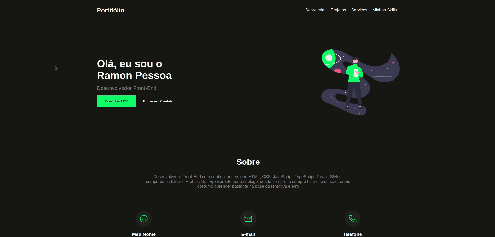

<h1>Portifólio</h1>

</img>

## 🤖 Tecnologias utilizadas
* React
* styled-components
* typescript
* Vite
* ESLint
* Prettier

## 💻 Pré-requisitos
Antes de começar, verifique se você atendeu oas seguintes requisitos:
* Ter um gerenciador de pacotes instalado, como: yarn ou npm
* Ter o git instalado

## 🚀 Instalando Portifólio
Para clonar este repositório siga os seguintes passos:
* abra o terminal na pasta desejada
* digite o seguinte comando:
```
  git clone https://github.com/RamonPessoa/portifolio.git
```
## ☕ Usando Portifólio
Utilize os seguintes comandos no terminal na pasta do repositório clonado:
```html
  yarn <!-- Iinstala todas as dependencias com o yarn -->

  OU

  npm install <!-- instala todas as dependencias com npm -->
```

Após instalar as dependências:
```html
  yarn dev <!-- Inicia o servidor de desenvolvimento-->
  yarn build <!-- constrói o projeto para produção-->
  yarn preview <!-- Inicia o servidor para preview em produção-->

  OU

  npm run dev <!-- Inicia o servidor de desenvolvimento-->
  npm run build <!-- constrói o projeto para produção-->
  npm run preview <!-- Inicia o servidor para preview em produção-->
```
